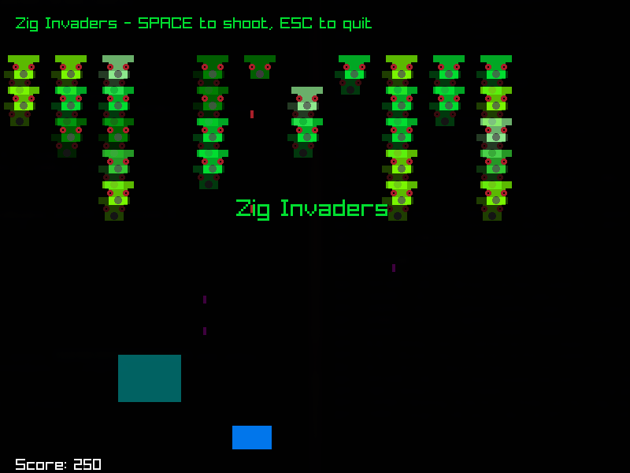
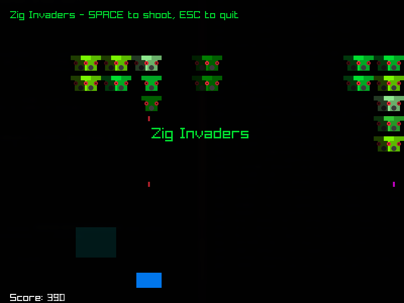

# 📖 Simple Space Invaders clone in Zig

Simple Space Invaders clone in Zig using raylib.






# Requirements
- Zig (0.15.2)
- raylib-zig, you can install it with:
```bash
zig fetch --save git+https://github.com/raylib-zig/raylib-zig#devel
```

# Build
```bash
zig build
```

# Run
```bash
zig build run
```